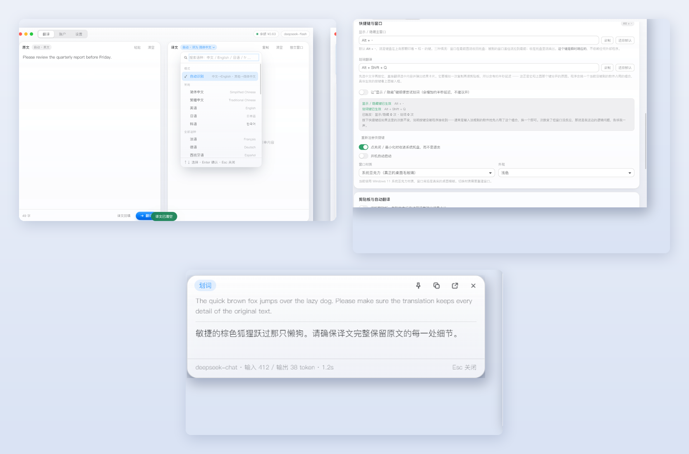

# DeepSeek 翻译器

> 基于 DeepSeek API 的 Windows 桌面翻译工具 · 常驻系统托盘 · 全局快捷键 · 选中即译



## 为什么是桌面程序而不是浏览器插件

「最小化到系统托盘」和「全局快捷键调出」这两件事，浏览器扩展做不到 —— 扩展拿不到系统托盘，也无法注册全局热键。

所以做成了独立的桌面程序（Electron）：在任何软件里选中文字，按一下快捷键就能翻译，不用先切到浏览器。

## 功能

| 功能 | 说明 |
|---|---|
| **划词翻译** | 任意程序里选中文字，按快捷键直接翻译，结果在置顶悬浮卡片上显示 |
| **全局快捷键** | 两个键分工：一个唤出/收起主窗口，一个取词翻译；都可在设置页「录制」修改 |
| **常驻托盘** | 最小化收进托盘、不占任务栏；关闭键是退出程序（两种行为刻意分开） |
| **Liquid Glass 界面** | 无边框窗口 + Windows 亚克力材质，跟随系统明暗主题 |
| **31 种语言** | 自动识别源语言，可指定目标语言；带搜索的语言选择器 |
| **流式输出** | 译文边生成边显示，随时可停 |
| **账户监控** | 余额与充值记录，读取你自己登录后的 DeepSeek 账户页面 |
| **省 token** | 提示词固定不变，命中上下文缓存按 1/10 计费；思考模式默认关闭 |
| **截断提示** | 译文撞到输出上限时明确告知，不会静默给你半句话 |

## 快速开始

### 1. 环境

- Windows 10 / 11
- Node.js 18+
- 一个 [DeepSeek API Key](https://platform.deepseek.com/api_keys)

### 2. 装依赖

```bash
git clone https://github.com/Joseph-new/DeepSeek-Translator.git
cd DeepSeek-Translator
npm install
```

> 国内网络可加镜像加速：
> ```bash
> export ELECTRON_MIRROR=https://npmmirror.com/mirrors/electron/
> npm install --registry=https://registry.npmmirror.com
> ```

### 3. 编译启动器（可选，但推荐）

双击 `make-launcher.bat`，会生成两个文件：

| 产物 | 作用 |
|---|---|
| `DeepSeek翻译器.exe` | 带图标、带程序名的启动器（`.vbs` 的图标改不了，这是 Windows 的限制） |
| `launcher\copy-helper.exe` | 划词取词用的按键注入小程序 |

编译依赖系统自带的 .NET Framework 编译器，Windows 一般都有。**不编译也能用**：直接双击 `启动翻译器.vbs`，只是划词会慢一些（走另一条备用路径）。

### 4. 启动并配置

双击 `DeepSeek翻译器.exe`（或 `启动翻译器.vbs`）。

首次运行到 **设置 → 接口 → API Key** 填入你的 Key，点 **拉取列表** 确认模型名，就可以用了。

## 快捷键

| 按键 | 作用 |
|---|---|
| `Alt + \`` | 唤出 / 收起主窗口 |
| `Alt + Q` | 划词翻译 |

两个键都可以在设置页重新录制。若组合键已被其他软件占用，程序会自动换一个备选组合，**设置页底部的状态区会实时显示当前实际生效的按键和触发次数** —— 按了没反应时先看那里。

## 目录结构

```
├── DeepSeek翻译器.exe      启动器（由 make-launcher.bat 生成，不在版本库里）
├── 启动翻译器.vbs          备选启动方式
├── start.bat               带控制台的启动，会自动补装依赖
├── selftest.bat            一键自检（含端到端验证与截图）
├── make-launcher.bat       编译启动器
├── launcher/               启动器与取词小程序的 C# 源码
├── src/
│   ├── main/               主进程：窗口、托盘、快捷键、取词、API
│   ├── preload/            上下文隔离下的桥接与页面注入
│   └── renderer/           界面（原生 HTML/CSS/JS）
├── assets/                 图标与图标生成脚本
├── 使用说明.md             面向使用者
└── 开发说明.md             面向改代码的人（设计决策 · 踩坑记录 · 实测数据）
```

## 开发

```bash
npm start          # 直接运行
```

双击 `selftest.bat` 跑自检。它会：切三个页面截图、走一遍真实翻译、验快捷键链路、检查余额接口、测配置持久化与取消翻译、验证截断提示、并确认关闭按键真的退出程序；最后单独跑一轮划词取词复核。

**改代码前请先读 [开发说明.md](开发说明.md)**：里面的「坑清单」记录了 25 条实际踩过的坑（比如 `ELECTRON_RUN_AS_NODE` 必须真正删除、设成空字符串无效），第 7 节记录了每个设计决策的实测依据。

## 数据与隐私

- **API Key 保存在 `%APPDATA%\DeepSeek 翻译器\config.json`**，不在程序目录，也不会进版本库
- 账户余额与充值记录，是通过内嵌窗口读取**你自己登录后**的页面数据，只存在本机，不上传任何地方
- 划词翻译需要模拟一次 `Ctrl + C`。程序的做法是先往剪贴板写一个临时标记、模拟复制、再看剪贴板有没有变成别的内容；**确认没有选中内容时会把剪贴板原样还回去**

## 说明

- 本项目是个人工具，与 DeepSeek 官方无关
- 使用的是 [DeepSeek 开放平台](https://platform.deepseek.com) 的公开 API；账户页面的数据读取依赖你自己的登录会话

## 许可

[MIT](LICENSE)
